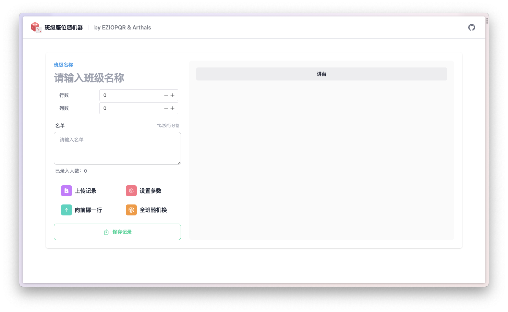

# Class-Randomizer



一个极简且优雅的班级座位随机器，支持如下功能：
* 配置生成、保存、读取
* 向前挪一行座位
* 全班随机排布座位
* 可视化座位表
* 可视化交换座位

## Usage

1. 安装依赖

    ```bash
    git clone git@github.com:zhuozhiyongde/Class-Randomizer.git
    cd Class-Randomizer
    pnpm install
    ```

2. 运行开发服务器
   
    ```bash
    pnpm dev
    ```

3. 打包

    ```bash
    pnpm build
    ```
你也可以直接访问[Vercel](https://class-randomizer.vercel.app/)上的部署版本。

## License
Under the [MIT](./LICENSE) License.